# 👋 Ciao, sono Leonardo Galli

### **Full-Stack Developer | IoT Developer | Low-Level & Systems Enthusiast**

**📍 Italy** | **⚽ Referee & Coder** | **⚙️ DevOps Learner** | **🌐 [another-horizon.eu](https://another-horizon.eu)**

*Plasmando logica a basso livello, costruendo sistemi intelligenti e automatizzando il futuro.*

---

## 🚀 Chi Sono

Sono **Leonardo** (chiamami pure **Leo**): sviluppatore **17enne** con la fissa per le architetture pulite, l'automazione, il firmware e le performance. Programmo da giovanissimo e oggi trasformo curiosità e disciplina in software che funziona davvero — dal singolo byte in puro C fino alle pipeline distribuite.

Porto nel codice la stessa disciplina, rapidità decisionale e rispetto delle regole che applico come **arbitro di calcio** sul terreno di gioco. Che si tratti di scrivere firmware per microcontroller, ottimizzare web app o costruire system tools in ANSI C, cerco sempre l'esecuzione perfetta.

**Cosa faccio:**
- 📟 **Low-Level Development** — Emulazione hardware, architetture a 4-bit e programmazione in puro ANSI C.
- 🛡️ **IoT & Microcontrollers** — Firmware sicuro e ad alte prestazioni per Arduino e sistemi embedded.
- 🏗️ **Full-Stack Architecture** — Dalla logica di backend fino alle moderne interfacce utente.
- ⚙️ **DevOps & Automation** — Pipeline CI/CD, containerizzazione con Docker e gestione di infrastrutture Cloud.
- 🔐 **Cybersecurity & Networking** — La sicurezza come principio di design, non come ripensamento.

---

## 💻 Tech Stack

  
  
  
  
  
  
  
  
  

  
  
  
  
  
  
  
  

---

## 🎯 Progetti in Evidenza

<table align="center" width="100%">
<tr>
<td align="center" width="50%">

### Aegis-Beacon
Sistema ad alte prestazioni per **Arduino** dedicato al monitoraggio e alla sicurezza di rete dei beacon.

</td>
<td align="center" width="50%">

### 74181 ALU
Emulatore software ad altissima fedeltà dello storico chip **ALU a 4-bit**, con supporto a cascata fino a 32 bit.

</td>
</tr>
<tr>
<td align="center" width="50%">

### Hydra-Obsidian
Framework distribuito per l'orchestrazione di cluster ad alte prestazioni: **ZMQ-mesh**, telemetria hardware in tempo reale e load balancing dinamico.

</td>
<td align="center" width="50%">

### Another-Horizon
Sito web business moderno con UI/UX curata, realizzato in **React**.

</td>
</tr>
</table>

> 💡 **E molto altro:** esplora tutte le repository su [github.com/Leo-Galli](https://github.com/Leo-Galli?tab=repositories).

---

## 📈 Statistiche GitHub

---

## 🌐 Connettiamoci

---

## 📖 Filosofia di Sviluppo

> *"Il codice pulito è come una partita arbitrata bene: quando tutto funziona alla perfezione, nessuno si accorge che ci sei."*

I miei principi cardine:
- **Scrittura Pulita** — Codice leggibile, efficiente e documentato.
- **Approccio Low-Level** — Capire cosa succede sotto al cofano per scrivere software migliore sopra.
- **Continuous Learning** — DevOps e Cybersecurity non sono opzionali, sono le fondamenta.
- **Quality over Quantity** — Poche architetture solide valgono più di tante feature fragili.
- **Collaborazione** — Il codice migliore nasce dal confronto e dall'open source.

 

### 🌟 Creiamo qualcosa di straordinario insieme!

**Disponibile per collaborazioni su progetti Open-Source, Firmware, IoT e Backend.**

 

