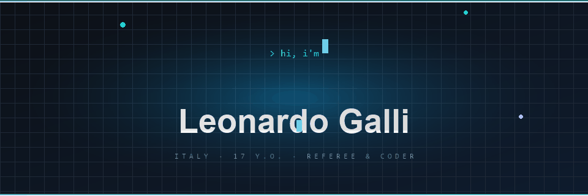

# Leonardo Galli

**Software engineer · Football referee**

*Practical technology, open-source projects and solutions designed to work offline too.*

---

<h3 align="center">The suite</h3>

  
  
  
  

  
  
  
  

  
  
  
  
  

---

<h3 align="center">Open source</h3>

  
  
  
  
  

---

<h3 align="center">Focus</h3>

  
  
  
  
  
  
  

---

<h3 align="center">Tech</h3>

  
  
  
  
  
  
  
  
  

  
  
  
  
  
  
  
  

---

<h3 align="center">GitHub</h3>

<picture>
  <source media="(prefers-color-scheme: dark)" srcset="https://raw.githubusercontent.com/Leo-Galli/Leo-Galli/main/dist/github-contribution-grid-snake-dark.svg" />
  <source media="(prefers-color-scheme: light)" srcset="https://raw.githubusercontent.com/Leo-Galli/Leo-Galli/main/dist/github-contribution-grid-snake.svg" />
  
</picture>

---

<h3 align="center">Connect</h3>

  
  
  
  

  

*"Clean code is like a well-refereed match: when everything works, nobody notices you were there."*

